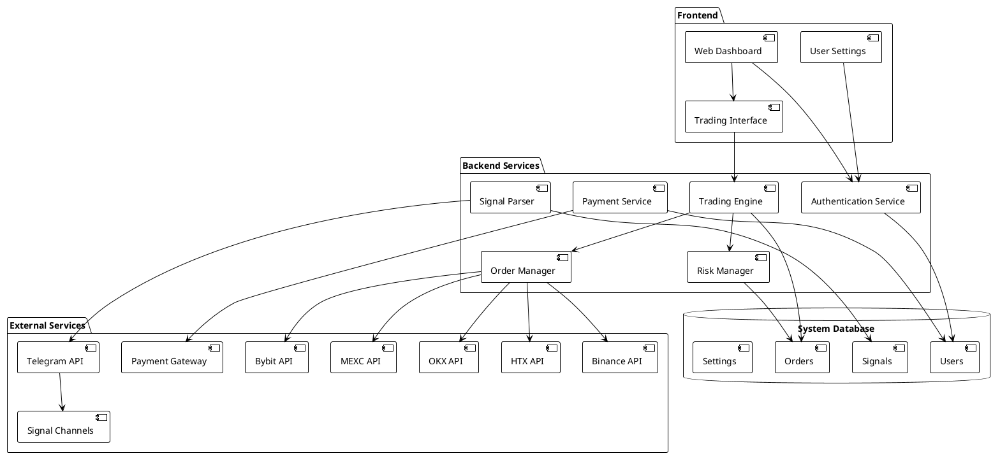
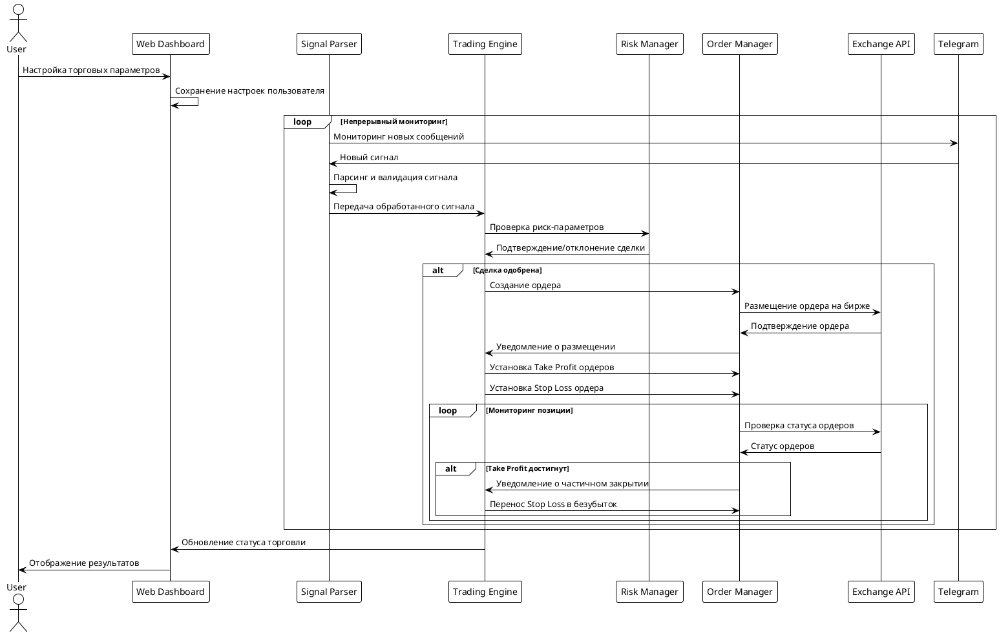
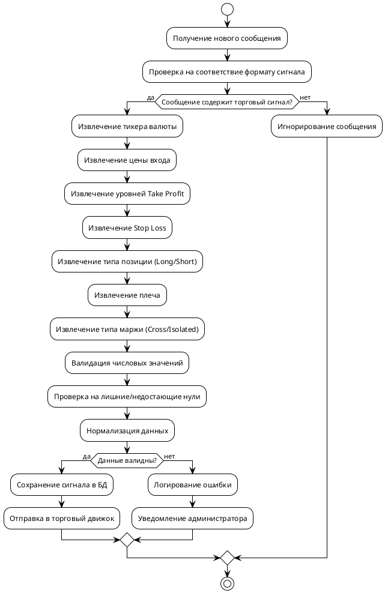
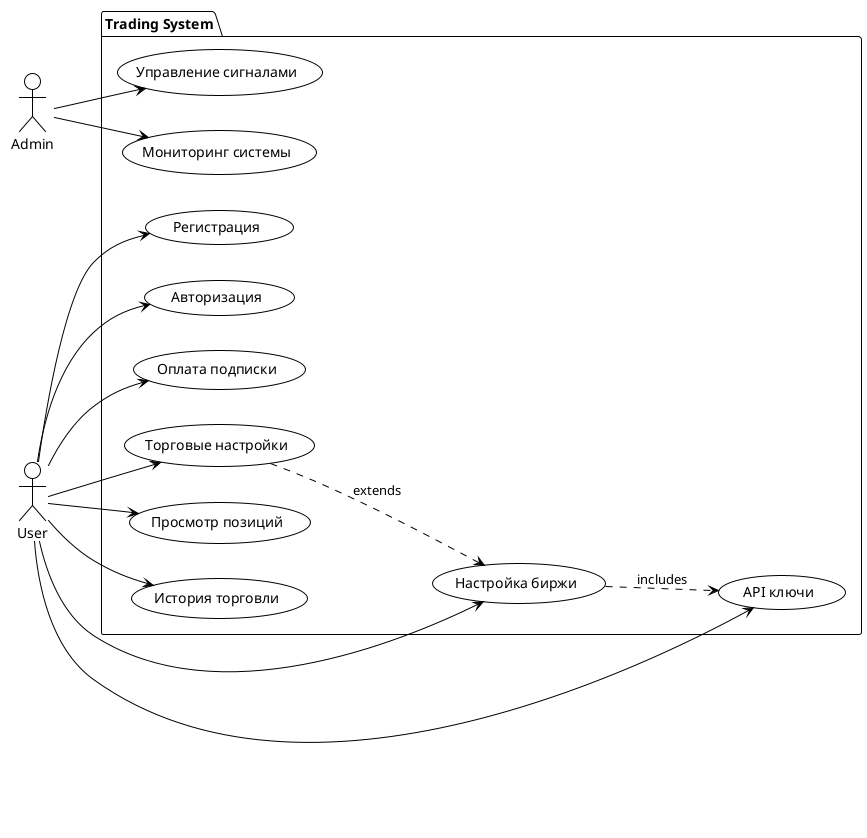
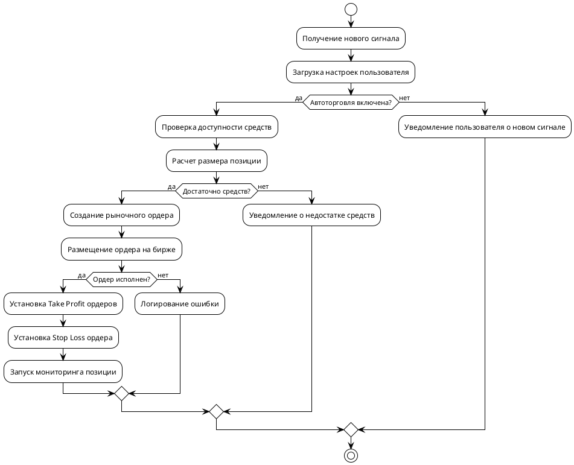
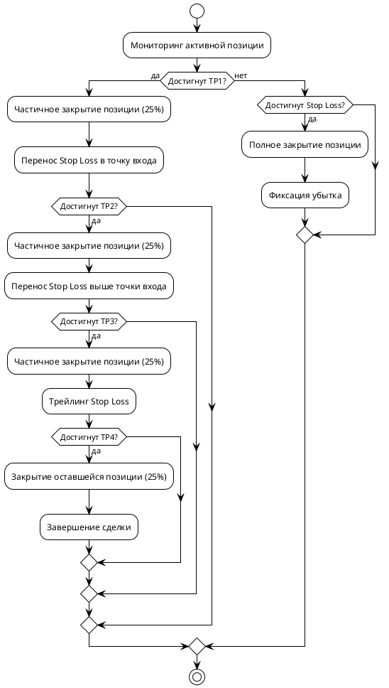
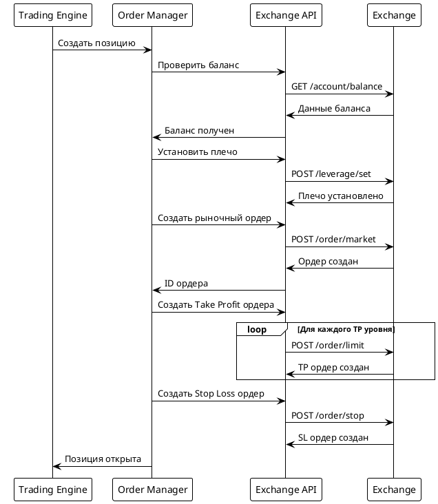
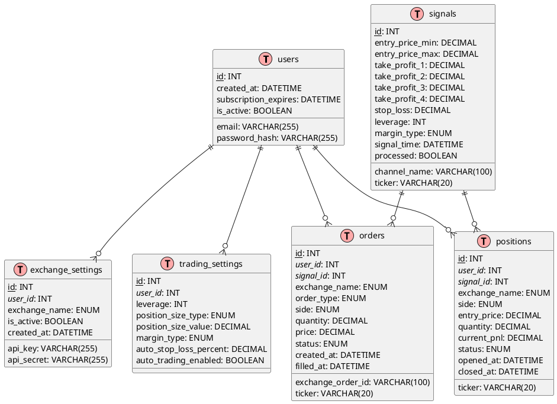

# Техническое задание: Система автоматической торговли криптовалютой

## 1. Общее описание проекта

### 1.1 Назначение системы
Разработка веб-платформы для автоматической торговли криптовалютой на основе торговых сигналов, получаемых из закрытых Telegram каналов. Система должна автоматически парсить сигналы, интерпретировать их и выполнять торговые операции на выбранных пользователем биржах.

### 1.2 Цели проекта
- Автоматизация процесса торговли криптовалютой
- Снижение человеческого фактора при принятии торговых решений
- Обеспечение быстрого входа в сделки по сигналам
- Управление рисками через автоматические стоп-лоссы и тейк-профиты

### 1.3 Ключевые особенности
- Парсинг сигналов из закрытых Telegram каналов
- Интеграция с 5 ведущими криптовалютными биржами
- Гибкие настройки риск-менеджмента
- Веб-интерфейс для управления торговлей
- Система подписок и платежей

## 2. Архитектура системы

### 2.1 Общая архитектура



### 2.2 Диаграмма последовательности торгового процесса



## 3. Функциональные требования

### 3.1 Модуль парсинга Telegram сигналов

#### 3.1.1 Основные функции
- Подключение к Telegram API через сессию аккаунта
- Мониторинг указанных закрытых каналов в реальном времени
- Парсинг торговых сигналов согласно предустановленным шаблонам
- Валидация и нормализация данных сигналов

#### 3.1.2 Формат обрабатываемых сигналов
```
Пример сигнала:
FUTURE TRADE (SEASON 2)
$RATS
Margin : 100-300$ 
Leverage : 5-25X
Type : Cross
Future Wallet: 1500$
Entry Price : 0.014- 0.018
TP1: 0.019
TP2: 0.02
TP3: 0.0205
TP4: 0.021
STOP LOSS 🛑 : 0.012
Holding Time: NA
CMC LINK : https://coinmarketcap.com/currencies/rats-ordinals/
```

#### 3.1.3 Алгоритм парсинга


### 3.2 Веб-интерфейс пользователя

#### 3.2.1 Страницы системы
1. **Регистрация/Авторизация**
   - Форма регистрации нового пользователя
   - Авторизация существующих пользователей
   - Восстановление пароля

2. **Выбор тарифного плана**
   - Отображение доступных планов подписки
   - Интеграция с платежной системой
   - Подтверждение оплаты

3. **Настройки биржи**
   - Выбор биржи из списка: Bybit, Binance, HTX, OKX, MEXC
   - Ввод API ключей (API Key, Secret Key)
   - Тестирование подключения к бирже

4. **Торговые настройки**
   - Настройка плеча (leverage) для сделок
   - Установка размера позиции (% от депозита или фиксированная сумма)
   - Настройка типа маржи (Cross/Isolated)
   - Настройка автоматического Stop Loss (в %)
   - Включение/отключение автоторговли

5. **Торговая панель**
   - Отображение активных позиций
   - История сделок
   - Текущий баланс
   - Статистика прибыли/убытков

#### 3.2.2 Use Case диаграмма



### 3.3 Торговый движок

#### 3.3.1 Основные функции
- Получение обработанных сигналов от парсера
- Применение пользовательских настроек к сигналу
- Расчет размера позиции
- Выставление ордеров через API бирж
- Управление позициями и ордерами

#### 3.3.2 Алгоритм обработки сигнала



### 3.4 Система управления рисками

#### 3.4.1 Функции риск-менеджмента
- Проверка максимального размера позиции
- Валидация плеча согласно настройкам пользователя
- Автоматический перенос Stop Loss в безубыток после первого Take Profit
- Контроль общего риска портфеля

#### 3.4.2 Алгоритм управления Take Profit



## 4. Интеграция с биржами

### 4.1 Поддерживаемые биржи
1. **Bybit** - основная биржа для фьючерсной торговли
2. **Binance** - крупнейшая криптовалютная биржа
3. **HTX** (бывший Huobi) - азиатская биржа
4. **OKX** - глобальная торговая платформа
5. **MEXC** - биржа с широким выбором альткоинов

### 4.2 Требуемые API методы для каждой биржи

#### 4.2.1 Методы для получения информации
- Получение баланса аккаунта
- Получение информации о торговых парах
- Получение текущих цен
- Получение информации о позициях
- История ордеров

#### 4.2.2 Методы для торговли
- Размещение рыночных ордеров
- Размещение лимитных ордеров
- Размещение стоп-ордеров
- Отмена ордеров
- Изменение плеча
- Переключение режима маржи

### 4.3 Диаграмма взаимодействия с API биржи



## 5. База данных

### 5.1 Схема базы данных



## 6. Технические требования

### 6.1 Технологический стек

#### 6.1.1 Backend
- **Язык программирования**: Python 3.9+
- **Framework**: FastAPI или Django REST Framework
- **База данных**: PostgreSQL 13+
- **ORM**: SQLAlchemy или Django ORM
- **Очереди задач**: Celery + Redis
- **WebSocket**: для real-time уведомлений

#### 6.1.2 Frontend
- **Framework**: React.js или Vue.js
- **UI библиотека**: Material-UI или Ant Design
- **State management**: Redux или Vuex
- **Графики**: TradingView Charting Library или Chart.js

#### 6.1.3 Инфраструктура
- **Контейнеризация**: Docker + Docker Compose
- **Веб-сервер**: Nginx
- **Мониторинг**: Grafana + Prometheus
- **Логирование**: ELK Stack (Elasticsearch, Logstash, Kibana)

### 6.2 Требования к производительности
- Время обработки сигнала: не более 5 секунд
- Время размещения ордера: не более 3 секунд
- Поддержка одновременной работы: до 1000 пользователей
- Доступность системы: 99.5%

### 6.3 Требования к безопасности
- Шифрование API ключей в базе данных (AES-256)
- HTTPS для всех соединений
- JWT токены для аутентификации
- Rate limiting для API запросов
- Логирование всех торговых операций

## 7. Интеграция с платежной системой

### 7.1 Поддерживаемые способы оплаты
- Банковские карты (Visa, MasterCard)
- Криптовалютные платежи (BTC, ETH, USDT)
- Электронные кошельки (PayPal, WebMoney)

### 7.2 Тарифные планы
- **Базовый**: $99/месяц - 1 биржа, базовые настройки
- **Продвинутый**: $199/месяц - 3 биржи, расширенные настройки
- **Профессиональный**: $399/месяц - все биржи, все функции

## 8. Мониторинг и логирование

### 8.1 Ключевые метрики
- Количество обработанных сигналов
- Время отклика API бирж
- Процент успешных сделок
- Количество активных пользователей
- Суммарный объем торгов

### 8.2 Типы логов
- Торговые операции (все ордера и их статусы)
- Ошибки парсинга сигналов
- Ошибки API бирж
- Действия пользователей
- Системные ошибки

## 9. Этапы разработки

### 9.1 Этап 1 (MVP) - 4 недели
- Базовая архитектура системы
- Парсинг сигналов из одного Telegram канала
- Интеграция с одной биржей (Bybit)
- Простой веб-интерфейс для настроек
- Базовая функциональность торговли

### 9.2 Этап 2 - 3 недели
- Интеграция с остальными биржами
- Расширенные настройки риск-менеджмента
- Улучшенный пользовательский интерфейс
- Система платежей и подписок

### 9.3 Этап 3 - 2 недели
- Мониторинг и аналитика
- Оптимизация производительности
- Тестирование и отладка
- Развертывание в продакшен

## 10. Риски и ограничения

### 10.1 Технические риски
- Нестабильность API бирж
- Ограничения скорости запросов
- Сбои в работе Telegram API
- Изменения формата сигналов

### 10.2 Финансовые риски
- Потери от неправильной торговли
- Слипедж при исполнении ордеров
- Комиссии бирж
- Волатильность криптовалютного рынка

### 10.3 Регулятивные риски
- Изменения в законодательстве о криптовалютах
- Блокировка бирж в некоторых юрисдикциях
- Требования по KYC/AML

## 11. Заключение

Данная система представляет собой комплексное решение для автоматизации криптовалютной торговли. Успех проекта зависит от качественной реализации всех компонентов, особенно парсинга сигналов и интеграции с биржами. Важно предусмотреть механизмы обработки ошибок и восстановления после сбоев, а также обеспечить высокий уровень безопасности для защиты средств пользователей.